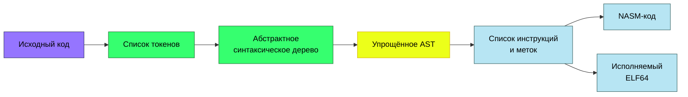
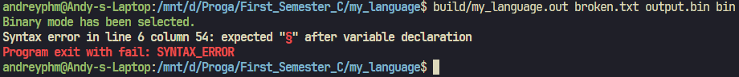
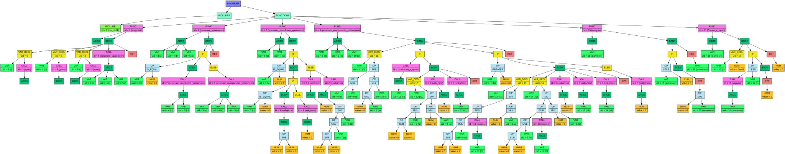

# My Language

**My Language** - учебный компилятор языка с синтаксисом в стиле математического анализа.

> [!NOTE]
> Сгенерированные программы предназначены только для **Linux x86-64**.

## Содержание

- [Пример программы](#пример-программы)
- [Возможности](#возможности)
- [Процесс компиляции](#процесс-компиляции)
  - [Frontend](#frontend)
  - [Стандарт AST](#стандарт-ast)
  - [Middleend](#middleend)
  - [Backend](#backend)
  - [ABI для x86-64](#abi-для-x86-64)
- [Обработка ошибок](#обработка-ошибок)
- [Синтаксис](#синтаксис)
  - [Формальная грамматика](#формальная-грамматика)
- [Стандартная библиотека](#стандартная-библиотека)
- [Сборка](#сборка)
- [Использование](#использование)
- [Графические дампы](#графические-дампы)
- [Структура проекта](#структура-проекта)
- [Ограничения](#ограничения)

## Пример программы

Так вычисляется факториал числа:

```text
возьмём <my_stdlib>

докажем факториал(число)
■
    предположим (число ≤ 1)
    ■
        сводится_к_предыдущему 1 §
    □
    в_противном_случае
    ■
        сводится_к_предыдущему число умножим_на факториал(число без 1) §
    □
□

докажем теорема()
■
    пусть x определим_как дано() §
    найдётся(факториал(x)) §
    сводится_к_предыдущему §
□
```

Готовые примеры находятся в каталоге [`test_programs`](test_programs):

- [`factorial.txt`](test_programs/factorial.txt) - рекурсивное вычисление факториала;
- [`square_solver.txt`](test_programs/square_solver.txt) - решение линейных и квадратных уравнений;

Синтаксис языка схож с синтаксисом C: в нём есть функции, блоки, переменные, условия, циклы и возврат значения.

## Возможности

- числа с плавающей точкой двойной точности (`double`);
- области видимости;
- функции с аргументами и возвращаемым значением;
- рекурсивные вызовы функций;
- условные конструкции `if` / `else`;
- цикл `while` и выход из цикла через `break`;
- арифметика, присваивание, сравнения и логические операции с коротким вычислением;
- встроенные ввод, вывод и квадратный корень;
- упрощение выражений;
- диагностика синтаксических ошибок с номером строки и столбца;
- графические дампы токенов, AST и списка инструкций;
- генерация NASM или исполняемого ELF64 из промежуточного списка инструкций.

## Процесс компиляции



### Frontend

Frontend выполняет три последовательных шага:

1. **Токенизация.** Исходный текст переводится в двусвязный список токенов. Для каждого токена сохраняются тип, значение, строка, столбец и длина.
2. **Рекурсивный спуск.** Список токенов преобразуется в абстрактное синтаксическое дерево с учётом приоритета операций.
3. **Семантический анализ.** Строятся области видимости, проверяются объявления переменных и функций, локальным переменным назначаются смещения в стековом кадре.

### Стандарт AST

AST состоит из узлов `node_t`. Каждый узел хранит вид `node_kind`, данные в `data_union`, значение `child_count` и динамический массив `children`. Порядок детей является частью формата. В таблице `N` означает текущее значение `child_count`.

| Узел | `child_count` | Данные | Дочерние узлы по порядку |
|---|---|---|---|
| `NODE_PROG` | `2` | нет | `[0]` - `NODE_INCLUDES`<br>`[1]` - `NODE_FUNCTIONS` |
| `NODE_INCLUDES` | `0..N` | нет | `[0..N-1]` - узлы `NODE_INCLUDE` |
| `NODE_FUNCTIONS` | `0..N` | нет | `[0..N-1]` - узлы `NODE_FUNC` |
| `NODE_INCLUDE` | `0` | `include.id_number` | нет |
| `NODE_FUNC` | `2` | `function.id_number`, `function.frame_size` | `[0]` - `NODE_ARGS` с параметрами<br>`[1]` - `NODE_BODY` |
| `NODE_BODY` | `0..N` | нет | `[0..N-1]` - инструкции в порядке выполнения |
| `NODE_ARGS` | `0..N` | нет | `[0..N-1]` - параметры `NODE_VAR` или выражения фактических аргументов |
| `NODE_NUM` | `0` | `number` | нет |
| `NODE_VAR` | `0` | `variable.id_number`, после анализа также `unique_id`, `stack_offset` | нет |
| `NODE_OP` | `2` | `op` | `[0]` - левый операнд<br>`[1]` - правый операнд |
| `NODE_CALL` | `1` | `function.id_number` | `[0]` - `NODE_ARGS` |
| `NODE_IF` | `2` или `3` | нет | `[0]` - условие<br>`[1]` - ветвь `NODE_BODY`<br>`[2]` - необязательная ветвь `NODE_ELSE` |
| `NODE_ELSE` | `0..N` | нет | `[0..N-1]` - инструкции альтернативной ветви |
| `NODE_WHILE` | `2` | нет | `[0]` - условие<br>`[1]` - тело `NODE_BODY` |
| `NODE_VAR_DECL` | `1` или `2` | после анализа `variable.unique_id`, `stack_offset` | `[0]` - объявляемая переменная `NODE_VAR`<br>`[1]` - необязательный инициализатор |
| `NODE_RET` | `0` или `1` | нет | `[0]` - необязательное возвращаемое выражение |
| `NODE_BREAK` | `0` | нет | нет |

Основные инварианты дерева:

- корнем всегда является `NODE_PROG` ровно с двумя дочерними узлами;
- списки подключений, функций, команд и аргументов представлены узлами с произвольным числом детей;
- отсутствие необязательного элемента выражается отсутствием дочернего узла;
- у `NODE_OP` с операцией `ASSIGN` узел `children[0]` всегда имеет вид `NODE_VAR`;
- `NODE_ELSE` имеет то же содержимое, что и `NODE_BODY`, но отдельный вид отмечает альтернативную ветвь.

Парсер заполняет структуру дерева, `id_number`, `number` и `op`. Затем семантический анализ добавляет `unique_id`, `stack_offset` и `frame_size`. Backend получает уже семантически проверенное дерево.

### Middleend

Middleend обходит AST до тех пор, пока в нём можно выполнить хотя бы одно упрощение.

Реализация использует наработки из другого проекта - [математического дифференциатора](https://github.com/andreyphm/differentiator). Из него перенесён общий подход к рекурсивному обходу и локальным алгебраическим преобразованиям дерева. Формат AST и набор преобразований адаптированы под данный проект.

Поддерживаются:

- свёртка константных арифметических выражений;
- вычисление константных сравнений и логических операций;
- удаление нейтральных операций: `x + 0`, `x - 0`, `x * 1`;
- свёртка выражений `x * 0`, `0 / x`;
- преобразование `0 - x` в `-1 * x`.

### Backend

Backend переводит AST в список инструкций и отдельный список меток:

```text
AST → instruction_list + label_list
```

После этого выбирается один из двух режимов:

| Режим | Результат | Что происходит |
|---|---|---|
| `nasm` | текстовый `.asm` | Инструкции и метки печатаются как NASM-код вместе с комментариями |
| `bin` | исполняемый ELF64 | Инструкции кодируются в машинный код, после чего формируются ELF-заголовки и сегменты |

### ABI для x86-64

Backend использует собственное соглашение о вызовах для функций языка.

#### Представление данных и регистры

| Элемент | Соглашение |
|---|---|
| Числа и логические значения | `double`, 8 байт; ложь - `0.0`, истина - `1.0` |
| Возвращаемое значение | `xmm0`; возврат без выражения даёт `0.0` |
| `rbp` | база текущего стекового кадра |
| `rsp` | стек вызовов, аргументов и временных значений выражений |
| `xmm0` | аккумулятор при вычислении выражений и регистр результата |

Функции восстанавливают `rbp` и `rsp` перед возвратом.

#### Стековый кадр

Размер области локальных переменных округляется вверх до 16 байт:

```nasm
push rbp
mov  rbp, rsp
sub  rsp, frame_size
```

Каждый параметр и локальная переменная занимает 8 байт по отрицательному смещению от `rbp`: `[rbp - 8]`, `[rbp - 16]` и так далее. Переменная без явного инициализатора получает `0.0`. Временные результаты выражений размещаются на стеке относительно текущего `rsp`. Генератор учитывает такие временные значения и перед вызовом при необходимости добавляет 8 байт для 16-байтного выравнивания.

В конце функция восстанавливает кадр:

```nasm
add rsp, frame_size
pop rbp
ret
```

#### Передача аргументов

Вызывающая сторона вычисляет аргументы и размещает их на стеке до инструкции `call`:

```text
[rsp + 0]  - первый аргумент
[rsp + 8]  - второй аргумент
[rsp + 16] - третий аргумент
...
```

После входа в вызванную функцию адрес возврата и сохранённый `rbp` занимают первые 16 байт. Поэтому вызываемая функция читает аргументы из `[rbp + 16 + i * 8]` и копирует их в собственные слоты `[rbp - 8 - i * 8]`. После возврата вызывающая сторона освобождает область аргументов, а результат остаётся в `xmm0`. Если выполнение дошло до конца функции без `сводится_к_предыдущему`, в `xmm0` возвращается `0.0`.

Служебные функции и встроенная операция корня используют отдельные короткие соглашения:

| Функция backend | Вход | Выход |
|---|---|---|
| `__in` | нет | число в `xmm0` |
| `__out` | число в `xmm0` | нет |
| `корень(x)` | выражение вычисляется в `xmm0` | результат `sqrtsd` в `xmm0` |

Встроенный `корень` генерируется как инструкция `sqrtsd` и не зависит от `my_stdlib`. Служебную функцию `__exit` backend всегда добавляет в генерируемый код. Она выполняет Linux-вызов `exit(0)`.

Имена пользовательских функций кодируются как `func_<id>`. Для точки входа дополнительно создаётся метка `main`, поэтому NASM-версию можно компоновать командой `ld -e main`.

#### Генерация ELF64

В бинарном режиме компилятор самостоятельно:

- вычисляет размеры инструкций и адреса меток;
- кодирует используемые x86-64-инструкции;
- формирует ELF-заголовок и таблицу программных заголовков;
- создаёт исполняемый сегмент `PT_LOAD` с кодом и правами `R-X`;
- создаёт отдельный сегмент `PT_LOAD` с константами и правами `R--`;
- при подключении `my_stdlib` добавляет её бинарный код;
- устраняет дубликаты числовых констант в `.rodata`.

## Обработка ошибок

Парсер сохраняет положение каждого токена, поэтому сообщение указывает точную строку и столбец ошибки. Ожидаемая конструкция дополнительно выделяется цветом в терминале.

Например, если после выражения пропущен символ `§`:

<p align="center">
  
</p>

На этапе построения областей видимости также обнаруживаются:

- повторное объявление переменной или функции;
- использование необъявленной переменной;
- вызов необъявленной функции;
- неправильное количество аргументов у встроенной или пользовательской функции;
- `достаточно` вне цикла;
- отсутствие точки входа или наличие нескольких точек входа.

## Синтаксис

### Ключевые конструкции

| Конструкция | Синтаксис |
|---|---|
| Подключение библиотеки | `возьмём <my_stdlib>` |
| Объявление функции | `докажем функция(аргументы)` |
| Точка входа | `докажем теорема()` |
| Объявление переменной | `пусть x §` |
| Объявление с инициализацией | `пусть x определим_как выражение §` |
| Присваивание | `x определим_как выражение §` |
| Условие | `предположим (условие) ■ ... □` |
| Альтернативная ветвь | `в_противном_случае ■ ... □` |
| Цикл | `пока_не_найдётся_эпсилон (условие) ■ ... □` |
| Выход из цикла | `достаточно §` |
| Возврат значения | `сводится_к_предыдущему выражение §` |
| Вызов функции | `функция(аргументы)` |

Блоки ограничиваются символами `■` и `□`, инструкция завершается символом `§`.

### Операции

| Категория | Операции |
|---|---|
| Арифметика | `вместе_с`, `без`, `умножим_на`, `поделим_на` |
| Сравнение | `равняется`, `≠`, `>`, `≥`, `<`, `≤` |
| Логические операции | `∨`, `∧` |
| Присваивание | `определим_как` |

Полный приоритет операторов зафиксирован формальной грамматикой ниже. В логическом контексте `0.0` считается ложью, а ненулевое значение - истиной. Результатом `∨` и `∧` всегда является `0.0` или `1.0`.

Логические операции используют короткое вычисление: правая часть `a ∨ b` не вычисляется, если `a` истинно, а правая часть `a ∧ b` - если `a` ложно.

### Формальная грамматика

Ниже приведена грамматика в формате, близком к РБНФ и соответствующем функциям рекурсивного спуска в [`front_end/source/parser.c`](front_end/source/parser.c).

Условные обозначения:

- `=` задаёт правило;
- `|` разделяет альтернативы;
- `[ ... ]` обозначает необязательную часть;
- `{ ... }` обозначает повторение ноль или более раз;
- терминальные символы языка заключены в кавычки;
- `EOF` обозначает конец входного файла.

```ebnf
Программа          = { Подключение }, { Функция }, EOF ;
Подключение        = "возьмём", "<", Идентификатор, ">" ;

Функция            = "докажем", Идентификатор,
                     "(", [ Параметры ], ")", Блок ;
Параметры          = Идентификатор, { ",", Идентификатор } ;

Блок               = "■", { Инструкция }, "□" ;
Инструкция         = Условие
                    | Цикл
                    | Объявление
                    | Возврат
                    | Выход_Из_Цикла
                    | Выражение, "§" ;

Условие            = "предположим", "(", Выражение, ")", Блок,
                     [ "в_противном_случае", Блок ] ;
Цикл               = "пока_не_найдётся_эпсилон",
                     "(", Выражение, ")", Блок ;
Объявление         = "пусть", Идентификатор,
                     [ "определим_как", Выражение ], "§" ;
Возврат            = "сводится_к_предыдущему", [ Выражение ], "§" ;
Выход_Из_Цикла     = "достаточно", "§" ;

Выражение          = Присваивание ;
Присваивание       = Идентификатор, "определим_как", Присваивание
                    | Логическое_ИЛИ ;
Логическое_ИЛИ     = Логическое_И, { "∨", Логическое_И } ;
Логическое_И       = Равенство, { "∧", Равенство } ;
Равенство          = Отношение,
                     { ( "равняется" | "≠" ), Отношение } ;
Отношение          = Сумма,
                     { ( ">" | "≥" | "<" | "≤" ), Сумма } ;
Сумма              = Произведение,
                     { ( "вместе_с" | "без" ), Произведение } ;
Произведение       = Первичное,
                     { ( "умножим_на" | "поделим_на" ), Первичное } ;

Первичное          = "(", Выражение, ")"
                    | Число
                    | Вызов
                    | Идентификатор ;
Вызов              = Идентификатор, "(", [ Аргументы ], ")" ;
Аргументы          = Выражение, { ",", Выражение } ;

Число              = Цифра, { Цифра }, [ ".", { Цифра } ] ;
Цифра              = "0" | "1" | "2" | "3" | "4"
                    | "5" | "6" | "7" | "8" | "9" ;
```

Идентификатор начинается не с цифры и продолжается до пробельного символа, специального символа или начала известного оператора. Ключевые слова распознаются раньше идентификаторов.

Присваивание правоассоциативно: `a определим_как b определим_как 1` разбирается как `a = (b = 1)`. Все повторяющиеся бинарные уровни от `∨` до умножения и деления левоассоциативны.

После синтаксического разбора действуют семантические правила:

- в программе должна быть ровно одна точка входа с именем `теорема` или `main`;
- переменная и функция должны быть объявлены, а повторное объявление в одной области запрещено;
- число фактических аргументов должно совпадать с числом параметров;
- `достаточно` допустимо только внутри цикла;
- левым операндом присваивания может быть только переменная.

## Стандартная библиотека

Библиотека [`my_stdlib.asm`](my_stdlib.asm) реализована на NASM и использует системные вызовы Linux напрямую. Она опциональна и подключается только директивой `возьмём <my_stdlib>`.

| Функция языка | Назначение | Сигнатура |
|---|---|---|
| `дано()` | Читает число из `stdin` | без аргументов, возвращает `double` |
| `найдётся(x)` | Печатает число и перевод строки | один аргумент |

Вывод содержит шесть знаков после точки.

Встроенная функция `корень(x)` в библиотеку не входит: backend генерирует для неё `sqrtsd` независимо от наличия директивы подключения. `__exit` также не входит в `my_stdlib` и всегда генерируется backend.

Если библиотека подключена, то в режиме `nasm` её исходный текст копируется в итоговый ассемблерный файл. В режиме `bin` команда `make` заранее собирает `my_stdlib.asm` как плоский бинарный блок, который backend добавляет в исполняемый сегмент ELF.

## Сборка

### Требования

- Linux x86-64;
- `g++` с поддержкой C++17;
- GNU Make;
- NASM;
- Graphviz (`dot`) для автоматических SVG-дампов;
- GNU `ld` для сборки исполняемого файла из NASM-режима.

Для Ubuntu/Debian зависимости можно установить так:

```bash
sudo apt update
sudo apt install build-essential nasm graphviz binutils
```

Клонирование и сборка:

```bash
git clone https://github.com/andreyphm/my_language.git
cd my_language
make all
```

Исполняемый файл - `build/my_language.out`, бинарная версия стандартной библиотеки - `build/my_stdlib.bin`.

Очистка результатов сборки:

```bash
make clean
```

## Использование

Общий формат команды:

```bash
./build/my_language.out <input-file> <output-file> [nasm|bin]
```

Если режим не указан, используется `nasm`.

### Готовый ELF64

```bash
./build/my_language.out test_programs/factorial.txt factorial bin
chmod +x factorial
./factorial
```

Команда `chmod +x factorial` добавляет файлу право на исполнение. Она нужна после первого создания файла, поскольку компилятор записывает ELF64 как обычный файл без исполняемого флага. Если право на исполнение уже было установлено ранее, повторять команду не требуется.

В этом режиме NASM и `ld` не участвуют в преобразовании списка инструкций в программу: ELF64 полностью формируется самим backend.

### NASM-код

```bash
./build/my_language.out test_programs/factorial.txt factorial.asm nasm
nasm -f elf64 factorial.asm -o factorial.o
ld -e main factorial.o -o factorial
./factorial
```

Сгенерированный `.asm` содержит имена меток и комментарии к функциям, переменным, вызовам и работе со стеком, поэтому подходит не только для сборки, но и для изучения результата компиляции.

## Графические дампы

Во время компиляции Graphviz автоматически создаёт три визуализации внутренних представлений.

### Список токенов

Токены располагаются змейкой в порядке чтения исходной программы. Токен содержит значение и позицию в исходном файле, цвет отражает его тип.

<details>
  <summary><b>Открыть дамп токенов</b></summary>
  <br>
  <a href="front_end/source/list_dump/list_dump.svg">
    
  </a>
</details>

### Абстрактное синтаксическое дерево

AST показывает структуру программы после синтаксического, семантического анализа и упрощений middleend: функции, блоки, вызовы, операции, переменные и числовые константы.

<details open>
  <summary><b>Открыть дамп AST</b></summary>
  <br>
  <a href="tree/tree_dump.svg">
    
  </a>
</details>

### Список инструкций

Последний дамп визуализирует линейное представление backend: мнемоники, операнды и метки, из которых затем независимо создаются NASM и ELF64.

<details>
  <summary><b>Открыть дамп списка инструкций</b></summary>
  <br>
  <a href="back_end/source/instructions_dump/instructions_dump.svg">
    
  </a>
</details>

## Структура проекта

```text
my_language/
├── front_end/      # токенизация, рекурсивный спуск, области видимости
├── middle_end/     # упрощение и свёртка выражений в AST
├── back_end/       # список инструкций, NASM- и ELF64-генераторы
├── tree/           # структура AST и её графический дамп
├── test_programs/  # примеры программ на языке
├── my_stdlib.asm   # опциональные ввод и вывод
├── main.c          # запуск стадий компилятора и выбор режима
└── Makefile
```

## Ограничения

- Целевая платформа - только Linux x86-64.
- Генерируется статический ELF.
- Поддерживается только реализованное backend подмножество инструкций x86-64.
- Стандартная библиотека работает с числами и не предоставляет строковый ввод-вывод.
- Оптимизации middleend ограничены локальными алгебраическими упрощениями и свёрткой констант.
